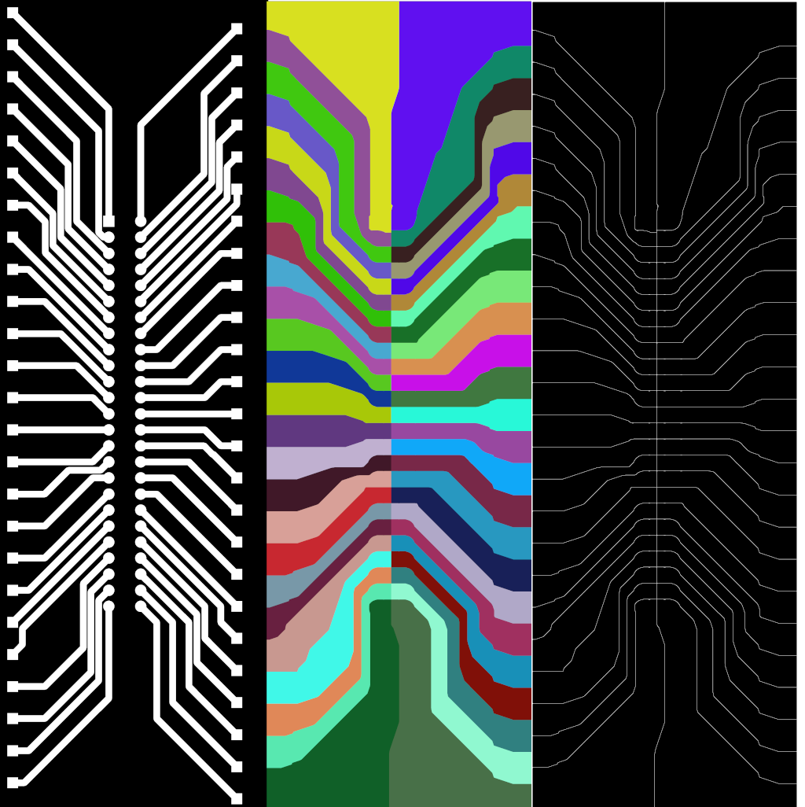
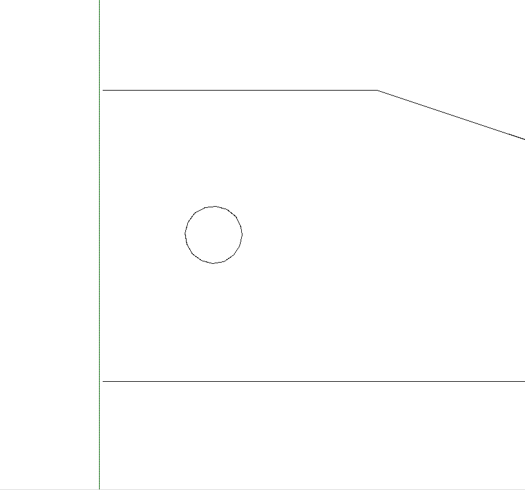
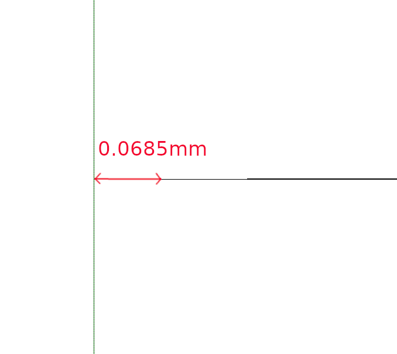
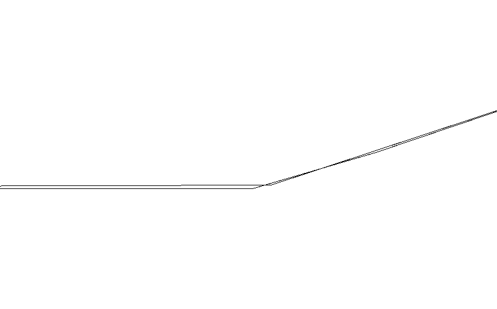

## kicad-laser-min

The application will take a PCB file generated by KICAD and create paths isolating all nets.
This is isolation routing for PCBs.

### Operation
The application uses a line Voronoi segmentation technique on the BW image of one layer of PCB. The Voronoi algorithm has been implemented in C++
by colorizing each track a different color. Each track is dilated until regions meet. Finally, an edge detection algorithm will produce the contours.
The contours produce the PCB region isolation. A contour following algorithm will transform the edge into gcode.

Double separation creates increase isolation between PCB tracks  (0.5mm per contour) .

The KICAD pcb to image conversion uses `<pxmm>` scale (which defaults to 30 pixels per mm).

Edge dilation takes time (why it is implemented in C++). The time is dependant on the `<pxmm>` scale.

Drill holes for pads and vias will be added to the end gcode. The holes drawn will be original size.


From left to right - BW Image of tracks, Colourized Dilation of tracks, Edge Detection of dilation.

## Note
The application is provided as is. I tested it with my own generated pcbs and worked well. However, your testing is also appreciated.
Please review outputs, especially gcode (as I am not an expert on any of the file formats used).

```KICAD Version used :
    Application: Pcbnew
    Version: 5.1.6-c6e7f7d~86~ubuntu18.04.1, release build
```

### Usage

```Usage:
Option: -m         Process map.png directly
        -f         Process Front Copper Layer.
        -b         Process Bottom and Front Copper Layer.
        -c         Do not cleanup after processing.
        -p<pxmm>   Change pixels per mm (default 30)
        -v        Don't Double Mark Vias
        -x        Mark Pads and Vias with '+'
        -d        Increase Separation between Isolated Zones
        -t       Increase Separation between Isolated Zones but include middle-trace
        -r       Override feedrate (default 120)

```

### Files
kicadpcb2contour.cpp

### Output Files
    map.png       - BW output image of Kicad PCB conversion
    cpp_image.png - your mind on LSD. The colorised image dilation of PCB tracks.
    trace.png     - Edge detection of the dilated image
    front.gcode   - Final gcode for Front Layer
    bottom.gcode  - Final gcode for Bottom Layer
    mask.png      - Mask of PCB to handle Edge cuts


### Dependencies
OpenCV libraries (version 4.5 used) with opencv_contrib (ximgproc)

### Compilation
Go into the directory and type in ```make```.

### Solved
Some offshoot tracks where created, output from opencv finContours. Contours outside the board are pruned out.

### Errors

However, as shown the inter-contour distance tolerance is of 0.0685mm. I have a laser cutter with an engraving width of 0.2mm (i.e. a
possible 0.1mm engraving width on the centre of track to a track coninciding from left or right side)

Contours do not touch.


However, distance is small enough to still function.


OpenCV follow contours creates two contours from both sides.
One could propose new findcontour method. No real problem here, rather than double time to process pcb.

